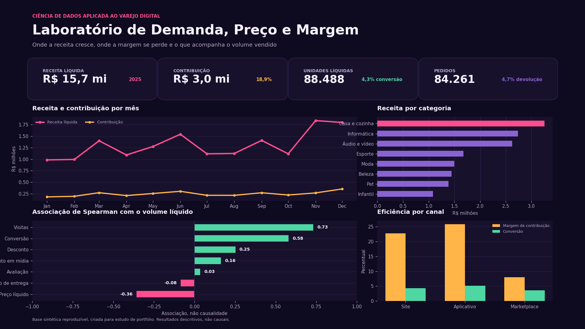
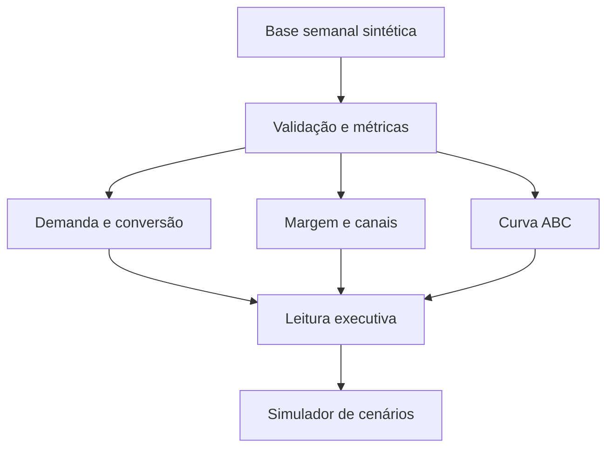

<div align="center">

# Laboratório de Demanda, Preço e Margem

**Ciência de dados aplicada a decisões comerciais de e-commerce**

[](https://www.python.org/)
[](https://streamlit.io/)
[](https://pandas.pydata.org/)
[](https://plotly.com/python/)
[](#qualidade-e-testes)
[](LICENSE)

</div>



## O problema de negócio

Um e-commerce pode aumentar vendas e, ao mesmo tempo, destruir margem. Desconto, tráfego, devolução, custo de mídia, taxa do canal e ruptura de estoque afetam partes diferentes do resultado.

Este projeto foi construído para responder a uma pergunta central:

> Quais fatores estão mais associados ao volume vendido e onde o crescimento deixa de gerar contribuição?

O resultado é um laboratório interativo que conecta demanda, rentabilidade, portfólio de produtos e cenários comerciais em uma única aplicação Streamlit.

## O que o projeto entrega

1. Visão executiva com receita, lucro bruto, contribuição, conversão e devolução.
2. Análise de associação de Spearman entre volume e fatores comerciais.
3. Comparação de rentabilidade por categoria, canal e faixa de desconto.
4. Curva ABC de 48 produtos, com indicadores de ruptura e devolução.
5. Simulador de preço, desconto, tráfego e elasticidade.
6. Upload de CSV com validação de estrutura.
7. Base sintética reproduzível e testes automatizados das regras principais.

## Principais resultados da base padrão

A análise executada sobre as 7.488 observações de 2025 encontrou:

| Indicador | Resultado |
|---|---:|
| Receita líquida simulada | R$ 15,7 milhões |
| Lucro bruto | R$ 5,4 milhões |
| Contribuição após mídia | R$ 3,0 milhões |
| Margem de contribuição | 18,9% |
| Unidades líquidas | 88.488 |
| Conversão | 4,3% |

Leituras relevantes:

- Visitas apresentaram a associação mais forte com o volume líquido, com correlação de Spearman de 0,73.
- Preço líquido apresentou associação negativa de 0,36 com o volume.
- Casa e cozinha liderou a receita, com aproximadamente R$ 3,25 milhões.
- Aplicativo obteve margem de contribuição de 25,8%, enquanto Marketplace ficou em 8,0%.
- Descontos de 20% ou mais geraram o maior volume, mas margem de contribuição de apenas 11,7%.
- A classe A reuniu 28 dos 48 produtos e respondeu por aproximadamente 78,7% da receita.

Essas relações são descritivas e foram construídas em uma base sintética. Associação não significa causalidade.

## Aplicação

### Visão executiva

Apresenta a evolução mensal de receita e contribuição, o desempenho por categoria e uma leitura automática do recorte selecionado.

### Demanda e conversão

Usa correlação de Spearman para investigar relações monotônicas entre unidades líquidas e visitas, conversão, desconto, mídia, avaliação, preço e prazo de entrega.

### Rentabilidade

Compara receita, lucro bruto e contribuição. A análise evidencia por que canais com volumes semelhantes podem entregar margens muito diferentes.

### Produtos e curva ABC

Ordena produtos pela participação na receita e identifica concentração, frequência de ruptura e taxa de devolução.

### Simulador comercial

Compara a média semanal observada com um cenário hipotético de preço, desconto, tráfego e elasticidade. O módulo é uma ferramenta de planejamento, não um modelo de previsão.

## Estrutura analítica



## Dados

A base padrão contém 52 semanas, 48 produtos, 8 categorias e 3 canais. Cada linha representa uma combinação de semana, produto e canal.

Os dados são sintéticos e foram gerados com semente fixa. O código incorpora relações coerentes com o objetivo didático, incluindo:

- preço líquido menor tende a elevar conversão;
- avaliação melhor tende a apoiar conversão;
- prazo maior tende a reduzir conversão;
- mídia influencia visitas;
- estoque limita as unidades vendidas;
- taxa do Marketplace reduz sua margem de contribuição.

O processo completo está documentado em [Dados e metodologia](docs/dados-e-metodologia.md). O dicionário está em [Dicionário de dados](docs/dicionario-de-dados.md).

## Fórmulas principais

```text
preço líquido = preço de lista × (1 - desconto)
unidades líquidas = unidades vendidas - unidades devolvidas
receita líquida = unidades líquidas × preço líquido
lucro bruto = receita líquida - custo do produto - taxa do canal
contribuição = lucro bruto - investimento em mídia
conversão = pedidos ÷ visitas
```

## Como executar

### 1. Clone o repositório

```bash
git clone https://github.com/bruno-dsn/ecommerce-analise-graficos.git
cd ecommerce-analise-graficos
```

### 2. Crie o ambiente virtual

No macOS ou Linux:

```bash
python3.14 -m venv .venv
source .venv/bin/activate
```

No Windows:

```powershell
py -3.14 -m venv .venv
.venv\Scripts\activate
```

### 3. Instale as dependências

```bash
python -m pip install --upgrade pip
python -m pip install -r requirements.txt
```

### 4. Abra a aplicação

```bash
python -m streamlit run app.py
```

## Reproduzir a base e as imagens

```bash
python scripts/gerar_dados.py
python scripts/gerar_visualizacoes.py
```

## Qualidade e testes

Os testes verificam geração reproduzível, fechamento das métricas financeiras, limites das correlações, classificação ABC e comportamento do simulador.

```bash
python -m pip install -r requirements-dev.txt
python -m pytest -q
```

## Estrutura do repositório

```text
ecommerce-analise-graficos/
├── app.py
├── assets/
│   ├── capa_linkedin.png
│   └── painel_ecommerce.png
├── data/
│   └── ecommerce_2025.csv
├── docs/
│   ├── como-ler-resultados.md
│   ├── dados-e-metodologia.md
│   ├── decisoes-do-projeto.md
│   └── dicionario-de-dados.md
├── notebooks/
│   └── analise_exploratoria.ipynb
├── scripts/
│   ├── gerar_dados.py
│   └── gerar_visualizacoes.py
├── src/
│   ├── analysis.py
│   ├── data.py
│   ├── metrics.py
│   └── simulation.py
├── tests/
├── requirements.txt
└── requirements-dev.txt
```

## Decisões e limitações

- A unidade de análise é semanal para permitir relações entre tráfego, conversão, estoque e resultado.
- Spearman foi escolhido por medir associação monotônica sem exigir relação linear.
- O custo do canal foi separado do custo do produto para tornar a diferença entre canais explicável.
- O simulador exige elasticidade informada pelo usuário porque o projeto não estima efeito causal.
- A base não representa uma empresa real e não inclui impostos, frete, cancelamentos ou estoque futuro.

Veja o raciocínio completo em [Decisões do projeto](docs/decisoes-do-projeto.md) e a interpretação responsável em [Como ler os resultados](docs/como-ler-resultados.md).

## Autor

**Bruno Nunes**
Ciência de Dados e Inteligência Artificial aplicada
[LinkedIn](https://www.linkedin.com/in/bruno-dsnunes/) | [GitHub](https://github.com/bruno-dsn)
